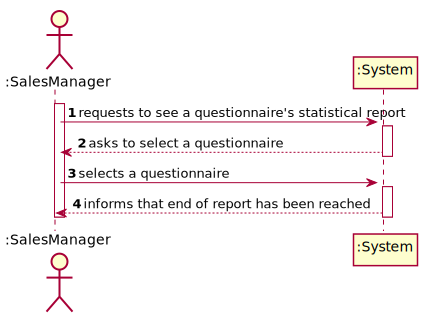
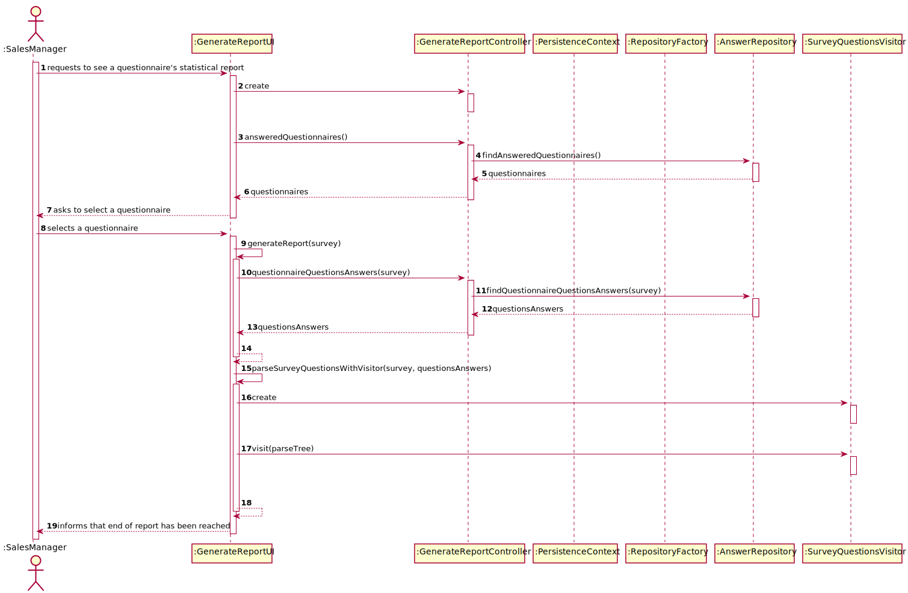

# 3002 - "As Sales Manager, I want to get a statistical report regarding a previously set up questionnaire."

# 1. Requisitos

**UC3002:** Como Sales Manager, pretendo gerar um relatório estatístico relativo a um questionário previamente configurado.

A interpretação feita deste requisito foi no sentido de permitir ao sales manager visualizar relatórios estatísticos dos questionários que existem no sistema.

# 2. Análise

## 2.1. Respostas do Cliente

> Q1: For this US, what are the types of statistical report that Sales Clerk want to see?
>
> A1: Any report must have the basic:
> 
> - Universe Size (implies knowing the amount of users the survey was distributed to);
> - Number of Responses Obtained
> - % of responses obtained;
>
>Further, something depending on the question type:
> 
> For “Single-Choice” questions:
> - Distribution (in %) of responses for each alternative (e.g.: A = 30%, B = 27%, C = 40%, Others = 3%)
>
> For “Multiple-Choice” questions:
> - Distribution (in %) of responses for each alternative (e.g.: A = 30%, B = 27%, C = 40%, Others = 3%)
> - Distribution (in %) of combined responses (e.g.: A+B = 15%, A+C = 100%, B+C=100%, A+B+C=10%)
>
> For “Sorting-Options” questions:
> - Distribution of the various hypotheses for each position (e.g.: 1st Place = A(40%) B (60%) C(0%); 2nd Place = A(50%) B(40%) C(10%); 3rd Place =A(10%) C(90%))
>
> For “Scaling-Options” questions:
> - Distribution of each option by scale levels.

> Q2: For this US, does the statistical report need to be shown to the SalesClerk or needs to be saved in some file too (p.e. text file)?
> 
> A2: The important is to show the statistical report.
> 
> Saving the report is not seen as relevant since, at any time, the user might request to see the report again.
>
> Notice that the information on which the report is computed is already persisted on the system.

## 2.2. Regras de Negócio

* "The report should be generated considering the given questionnaire and the set of answers obtained until the current moment."

# 3. Design

## 3.1. Realização da Funcionalidade

### 3.1.1. Modelo de Domínio:

### 3.1.2. Classes de Domínio:

Controlador: GenerateReportController

### 3.1.3. Diagrama de Sequência do Sistema:

### 3.1.4. Diagrama de Sequência:

## 3.2. Diagrama de Classes

# 4. Implementação

## 4.1. Classe ...

# 3. Integração/Demonstração

Esta User Story depende da User Story 3001 e 3501, uma vez que é necessária a existência de questionários, que por sua vez podem ser respondidos por clientes, para que possam ser gerados relatórios com os resultados obtidos.

# 4. Observações

n/a