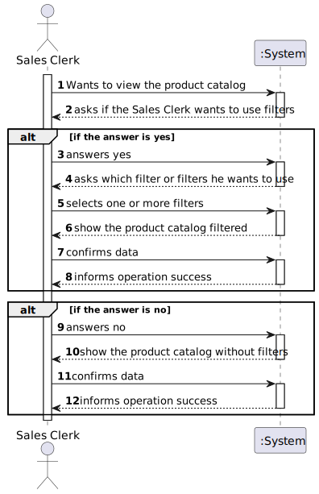
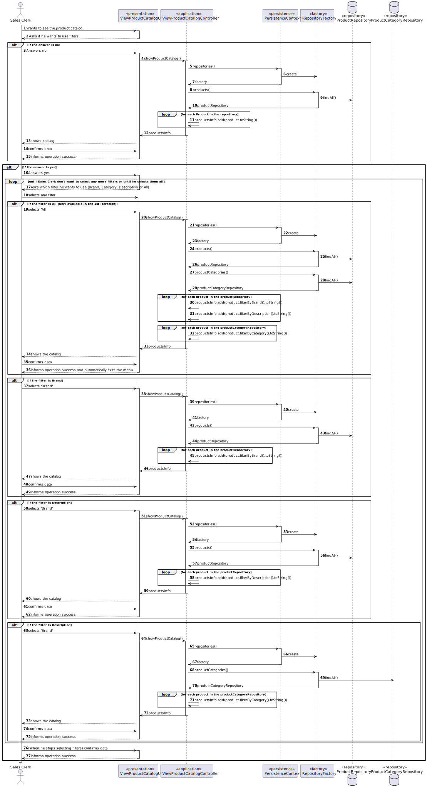
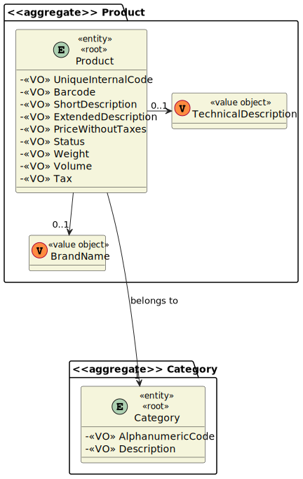
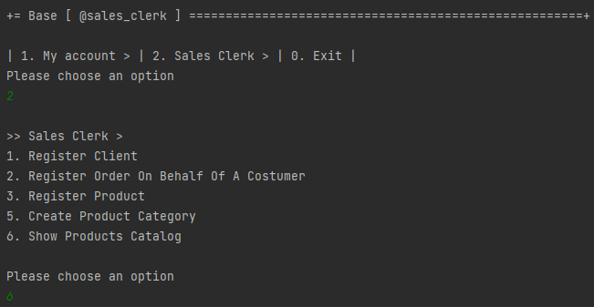
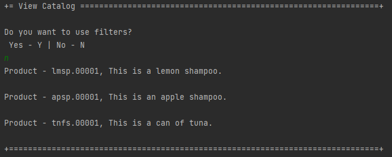
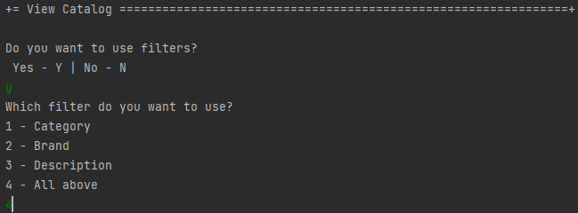
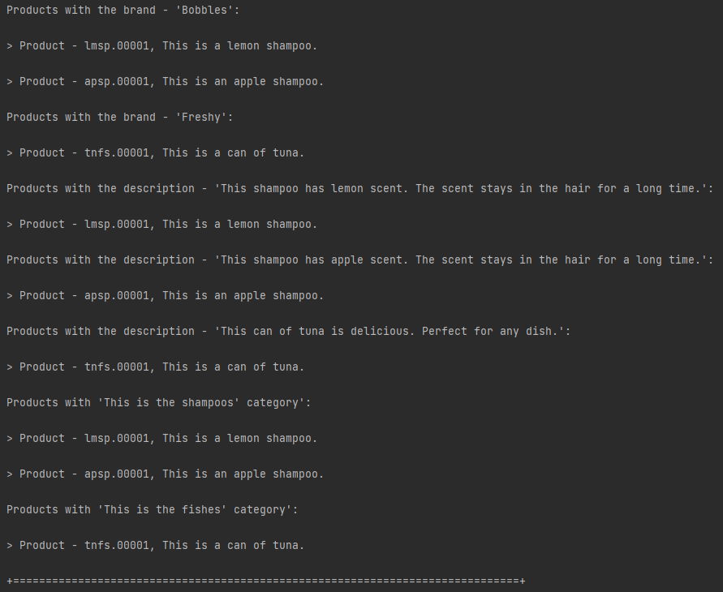

# 1002 - "As Sales Clerk, I want to view/search the products catalog."

# 1. Requisitos

**UC1002:** Como Sales Clerk, eu quero visualizar o catálogo de produtos.

A interpretação feita deste requisito foi a de mostrar as informações básicas de um ou mais produtos que estejam registados no sistema, ou seja, que estejam no catálogo, tendo em conta que poderá, ou não, haver filtros para efetuar essa pesquisa.

# 2. Análise

## 2.1. Respostas do Cliente

## 2.2. Regras de Negócio

* Deveram ser disponibilizados ao utilizador 3 filtros diferentes (Brand, Description e Category) e este deve poder selecionar se quer usar, ou não, filtros e, se sim, quais quer utilizar na sua pesquisa.

# 3. Design

*Nesta secção a equipa deve descrever o design adotado para satisfazer a funcionalidade. Entre outros, a equipa deve apresentar diagrama(s) de realização da funcionalidade, diagrama(s) de classes, identificação de padrões aplicados e quais foram os principais testes especificados para validar a funcionalidade.*

*Para além das secções sugeridas, podem ser incluídas outras.*

## 3.1. Realização da Funcionalidade

### 3.1.1. Classes de Domínio:

* AGV, AVGDock
* Controlador:
    * AGVController
* Repository:
    * AGVRepository

### 3.1.2. Diagrama de Sequência do Sistema:

### 3.1.3. Diagrama de Sequência:

## 3.2. Diagrama de Classes

## 3.3. Padrões Aplicados

*Nesta secção deve apresentar e explicar quais e como foram os padrões de design aplicados e as melhores práticas.*

## 3.4. Testes
*Nesta secção deve sistematizar como os testes foram concebidos para permitir uma correta aferição da satisfação dos requisitos.*

# 4. Implementação

*Nesta secção a equipa deve providenciar, se necessário, algumas evidências de que a implementação está em conformidade com o design efetuado. Para além disso, deve mencionar/descrever a existência de outros ficheiros (e.g. de configuração) relevantes e destacar commits relevantes;*

    public class ViewProductCatalogController {
      private final AuthorizationService authz = AuthzRegistry.authorizationService();
  
      private final ProductRepository productRepository = PersistenceContext.repositories().products();
  
      private final ProductCategoryRepository productCategoryRepository = PersistenceContext.repositories().productCategories();
  
      public List<String> showProductCatalogFilteredByAll(){
          Iterable<String> filteredByBrand = new ArrayList<>();
          Iterable<String> filteredByDescription = new ArrayList<>();
          Iterable<String> filteredByCategory = new ArrayList<>();
          List<String> catalog = new LinkedList<>();
  
          filteredByBrand = showProductCatalogFilteredByBrand();
  
          for(String brand : filteredByBrand){
              catalog.add(brand);
          }
  
          filteredByDescription = showProductCatalogFilteredByDescription();
  
          for(String description : filteredByDescription){
              catalog.add(description);
          }
  
          filteredByCategory = showProductCatalogFilteredByCategory();
  
          for(String category : filteredByCategory){
              catalog.add(category);
          }
  
          return catalog;
      }
  
      public List<String> showProductCatalogFilteredByBrand(){
          Iterable<BrandName> filteredByBrand = new ArrayList<>();
          List<String> catalogByBrand = new LinkedList<>();
          Iterable<Product> productFilteredByBrand = new ArrayList<>();
  
          filteredByBrand = productRepository.findAllBrandName();
  
          for(BrandName brand : filteredByBrand){
              catalogByBrand.add(String.format("Products with the brand - '%s': \n", brand.brandName()));
  
              productFilteredByBrand = productRepository.findByBrandName(brand);
  
              for(Product product : productFilteredByBrand){
                  catalogByBrand.add(String.format("> %s", product.toString()));
              }
          }
  
          return catalogByBrand;
      }
  
      public List<String> showProductCatalogFilteredByDescription(){
          Iterable<ExtendedDescription> filteredByDescription = new ArrayList<>();
          List<String> catalogByDescription = new LinkedList<>();
          Iterable<Product> productFilteredByDescription = new ArrayList<>();
  
          filteredByDescription = productRepository.findAllDescription();
  
          for(ExtendedDescription description : filteredByDescription){
              catalogByDescription.add(String.format("Products with the description - '%s': \n", description.extendedDescription()));
  
              productFilteredByDescription = productRepository.findByExtendedDescription(description);
  
              for(Product product : productFilteredByDescription){
                  catalogByDescription.add(String.format("> %s", product.toString()));
              }
          }
  
          return catalogByDescription;
      }
  
      public List<String> showProductCatalogFilteredByCategory(){
          Iterable<ProductCategory> filteredByCategory = new ArrayList<>();
          List<String> catalogByCategory = new LinkedList<>();
          Iterable<Product> productFilteredByCategory = new ArrayList<>();
  
          filteredByCategory = productCategoryRepository.findAllCategory();
  
          for(ProductCategory category : filteredByCategory){
              catalogByCategory.add(String.format("Products with '%s': \n", category.getDescription()));
  
              productFilteredByCategory = productRepository.findByCategory(category);
  
              for(Product product : productFilteredByCategory){
                  catalogByCategory.add(String.format("> %s", product.toString()));
              }
          }
  
          return catalogByCategory;
      }
  
      public List<String> showProductCatalog(){
          List<String> catalog = new LinkedList<>();
  
          for(Product product : productRepository.findAll()){
              catalog.add(product.toString());
          }
  
          return catalog;
      }
    }

# 5. Integração/Demonstração

*Nesta secção a equipa deve descrever os esforços realizados no sentido de integrar a funcionalidade desenvolvida com as restantes funcionalidades do sistema.*

# 6. Observações

*Nesta secção sugere-se que a equipa apresente uma perspetiva critica sobre o trabalho desenvolvido apontando, por exemplo, outras alternativas e ou trabalhos futuros relacionados.*

