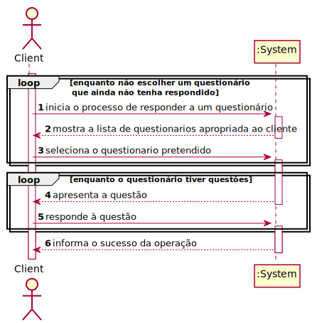
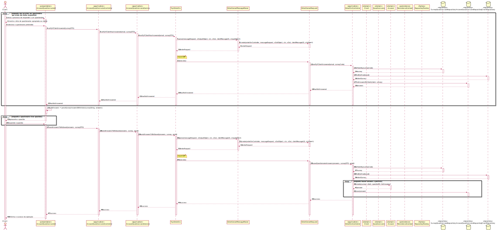
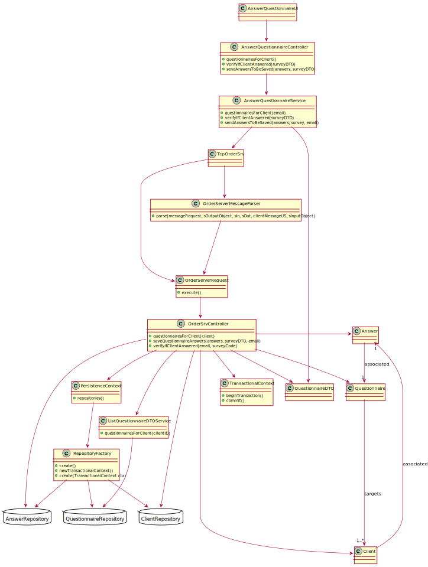

# US3501 - Enquanto cliente, pretendo responder a um questionário
=======================================

# 1. Requisitos

US3501 - Enquanto cliente, pretendo responder a um questionário

### 1.1 Especificações e esclarecimentos do cliente

# 2. Análise

## 2.1 Excerto do Modelo de Domínio

## 2.2 System Sequence Diagram (SSD)

# 3. Design

## 3.1. Realização da Funcionalidade

*Nesta secção deve apresentar e descrever o fluxo/sequência que permite realizar a funcionalidade.*

## 3.1.1 Sequence Diagram (SD)

## 3.2. Diagrama de Classes

*Nesta secção deve apresentar e descrever as principais classes envolvidas na realização da funcionalidade.*

## 3.3. Padrões Aplicados

Foram aplicados os padrões princípios SOLID e GoF

### Creator

### Repository

### Factory

### Information Expert 

*Nesta secção deve apresentar e explicar quais e como foram os padrões de design aplicados e as melhores práticas.*

## 3.4. Testes 
*Nesta secção deve sistematizar como os testes foram concebidos para permitir uma correta aferição da satisfação dos requisitos.*

**Teste 1:** Verificar que não é possível criar uma instância da classe Exemplo com valores nulos.

	@Test(expected = IllegalArgumentException.class)
		public void ensureNullIsNotAllowed() {
		Exemplo instance = new Exemplo(null, null);
	}

# 4. Implementação

# 5. Integração/Demonstração

# 6. Observações

