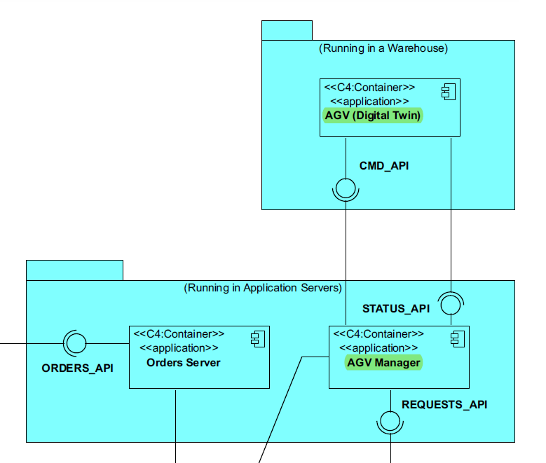

# 5003 - "As Project Manager, I want the input communications (of the AGV Digital Twin) made through the SPOMS2022 protocol to be secured/protected."

# 1. Requisitos

**UC5001:** Como Project Manager pretendo que o modúlo de comunicação por input do AGV digital twin, feito a partir do protocolo SPOMS2022, esteja seguro/protegido.

A interpretação feita deste requisito foi no sentido de deixar seguras as ligações de input para o AGV digital twin.

# 2. Análise

## 2.1. Respostas do Cliente

n/a

## 2.2. Regras de Negócio

* Deve complementar a US5001.
* Deve adotar SSL/TLS com autenticação mútua, baseado em certificados de chave públicos.

# 3. Design

## 3.1. Padrões Aplicados

### SPOMS2022

### Threads

### SSL/TLS com autenticação mútua, baseado em certificados de chave públicos

# 3.2 Funcionamento do SSL/TLS com autenticação mútua, baseado em certificados de chave públicos

* Sempre que o cliente solicita um request, através de uma conexão TCP, segue-se o seguinte fluxo de comunicação:

**1** A client requests access to a protected resource.
**2** The server presents its certificate to the client.
**3** The client verifies the server’s certificate.
**4** If successful, the client sends its certificate to the server.
**5** The server verifies the client’s credentials.
**6** If successful, the server grants access to the protected resource requested by the client.

# 4. Implementação

## 4.1. Classe TcpSrvAgvManager

    [...]
        if(clientMessageUS[1] == 7){
            ObjectOutputStream sendAGVsToChangeList = new ObjectOutputStream(s.getOutputStream());
            [...]
        }
    [...]

## 4.2. Classe TcpCliAGVTwin

    [...]
        byte[] optionMessage = {(byte) 0, (byte) 7, (byte) 0, (byte) 0};
        sOutData.write(optionMessage);
        sOutData.flush();
        List<AGV> agvsToUpdate;
        ObjectInputStream sInObject = new ObjectInputStream(sock.getInputStream());
        ObjectOutputStream sOutObject = new ObjectOutputStream(sock.getOutputStream());
        agvsToUpdate = (List<AGV>) sInObject.readObject();
        updateAgvStatus(agvsToUpdate);
    [...]

# 5. Integração/Demonstração

No âmbito desta US, são efetuados os seguintes requests:

| Código | Request                     |
|--------|-----------------------------|
| 7      | Atualizar os status dos AGV |

Esta User Story depende da User Story 4001, uma vez que é necessária a existência do AGVManager para que esta US funcione do modo pretendido.

# 6. Observações

Uma vez que para esta US não é criada qualquer tipo de entidade, não foi criada nenhuma classe de testes.
Também não foram criados diagramas, uma vez que esta US refere-se apenas à interação entre server e client.
Para este Sprint, foi criado um ambiente virtual destinado ao AGV Digital Twin Client e Server.  
Apesar de o jar correr de forma bem sucedida nos servidores do isep, ao chamar os repositórios das bases de dados necessários à execução desta US, dá erro.  
Será algo a resolver no próximo Sprint.