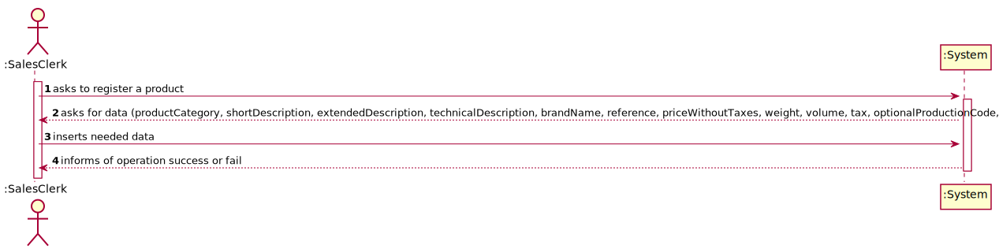
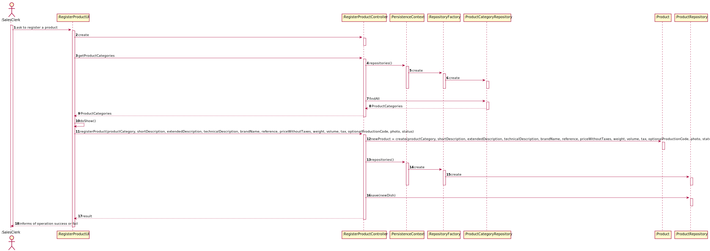

# 1001 - "As Sales Clerk, I want to specify a new product for sale."

# 1. Requisitos

**UC1001:** Como Sales Clerk pretendo criar um novo produto para venda.

A interpretação feita deste requisito foi no sentido de criar um novo produto e colocá-lo disponível para compra.

# 2. Análise

## 2.1. Respostas do Cliente

>Q1: "Can the Product be a part of a Super Category and a Category or will the Product be a part of a Category and that Category is a part of the Super Category?"
>
>A1: "...Contrary to what is suggested in your question, there is no hierarchy between categories."

>Q2: "Regarding the barcode of a given product what should the coding standard be?"
>
>A2: "Any of the supported standards. It might be set by configuration at system implantation time."

>Q3: "Still regarding the barcode should the identifier be sequential, if not what method should we use to generate the identifier?"
>
>A3: "Barcodes are manually introduced by users since each product barcode is provided by the product manufacture."

>Q4: "It was mentioned in a previous question that both the production code and the internal code have a set regular expression, could an example of said regular expressions be given?"
>
>A4: "For example, 4 letters followed by a dot (".") and ending with 5 digits."

>Q5: "Can the regular expression be changed by an employee, if so which one?"
>
>A5: "No! Such regular expressions are set by configuration at system implantation time."

>Q6: "Regarding the barcode of the product should an image be generated or only the code be saved?"
>
>A6: "No image is required to be generated."

>Q7: Regarding the measures of the product(width/length/height and weight) what are the units of measurement that should be supported?
>
>A7: "...the width, length and height of a product is specified in millimeters..." "...the weight of the product is specified in grams."

## 2.2. Regras de Negócio

* A referência de um produto tem que ser única no sistema;
* O preço sem taxas é sempre superior a zero Euros;
* A taxa de um produto é sempre superior ou igual a zero Euros;
* O peso de um produto é sempre superior a zero;
* O volume de um produto é sempre superior a zero;
* O status de um produto pode apenas ser Available, Temporarily Unavailable ou Unavailable.

# 3. Design

*Nesta secção a equipa deve descrever o design adotado para satisfazer a funcionalidade. Entre outros, a equipa deve apresentar diagrama(s) de realização da funcionalidade, diagrama(s) de classes, identificação de padrões aplicados e quais foram os principais testes especificados para validar a funcionalidade.*

*Para além das secções sugeridas, podem ser incluídas outras.*

## 3.1. Realização da Funcionalidade

### 3.1.1. Classes de Domínio:

* Product, ProductCategory
* Product um agregado independente de ProductCategory:
  * relação unidirecional many-to-one
  * cascade NONE
  * fetch EAGER
* Barcode
* OptionalProductCode
* UniqueInternalCode
* Photo
* Controlador:
  * RegisterProdutController
* Repository:
  * ProductRepository

### 3.1.2. Diagrama de Sequência do Sistema:

### 3.1.3. Diagrama de Sequência:

## 3.2. Diagrama de Classes

## 3.3. Padrões Aplicados

*Nesta secção deve apresentar e explicar quais e como foram os padrões de design aplicados e as melhores práticas.*

## 3.4. Testes
*Nesta secção deve sistematizar como os testes foram concebidos para permitir uma correta aferição da satisfação dos requisitos.*

**Teste 1:** Verificar que não é possível criar uma instância da classe Product com valores nulos.

	@Test(expected = IllegalArgumentException.class)
        //to develop
    }

**Teste 2:** Verificar que não é possível criar uma instância da classe Product com referência nula.

	@Test(expected = IllegalArgumentException.class)
        //to develop
    }

**Teste 3:** Verificar que não é possível criar uma instância da classe Product com referência vazia.

	@Test(expected = IllegalArgumentException.class)
        //to develop
    }

**Teste 4:** Verificar que não é possível criar uma instância da classe Product com PriceWithoutTaxes nulo.

	@Test(expected = IllegalArgumentException.class)
        //to develop
    }

**Teste 5:** Verificar que não é possível criar uma instância da classe Product com PriceWithoutTaxes menor do que zero.

	@Test(expected = IllegalArgumentException.class)
        //to develop
    }

**Teste 6:** Verificar que não é possível criar uma instância da classe Product com PriceWithoutTaxes igual a zero.

	@Test(expected = IllegalArgumentException.class)
        //to develop
    }

**Teste 7:** Verificar que não é possível criar uma instância da classe Product com Tax nula.

	@Test(expected = IllegalArgumentException.class)
        //to develop
    }

**Teste 8:** Verificar que não é possível criar uma instância da classe Product com Tax menor do que zero.

	@Test(expected = IllegalArgumentException.class)
        //to develop
    }

**Teste 9:** Verificar que não é possível criar uma instância da classe Product com Weight nula.

	@Test(expected = IllegalArgumentException.class)
        //to develop
    }

**Teste 10:** Verificar que não é possível criar uma instância da classe Product com Weight menor do que zero.

	@Test(expected = IllegalArgumentException.class)
        //to develop
    }

**Teste 11:** Verificar que não é possível criar uma instância da classe Product com Weight igual a zero.

	@Test(expected = IllegalArgumentException.class)
        //to develop
    }

**Teste 12:** Verificar que não é possível criar uma instância da classe Product com Volume nulo.

	@Test(expected = IllegalArgumentException.class)
        //to develop
    }

**Teste 13:** Verificar que não é possível criar uma instância da classe Product com Volume menor do que zero.

	@Test(expected = IllegalArgumentException.class)
        //to develop
    }

**Teste 14:** Verificar que não é possível criar uma instância da classe Product com Volume igual a zero.

	@Test(expected = IllegalArgumentException.class)
        //to develop
    }

**Teste 15:** Verificar que não é possível criar uma instância da classe Product com Status nulo.

	@Test(expected = IllegalArgumentException.class)
        //to develop
    }

**Teste 16:** Verificar que não é possível criar uma instância da classe Product com Status diferente de Available, Temporarily Unavailable ou Unavailable.

	@Test(expected = IllegalArgumentException.class)
        //to develop
    }

# 4. Implementação

*Nesta secção a equipa deve providenciar, se necessário, algumas evidências de que a implementação está em conformidade com o design efetuado. Para além disso, deve mencionar/descrever a existência de outros ficheiros (e.g. de configuração) relevantes e destacar commits relevantes;*

*Recomenda-se que organize este conteúdo por subsecções.*

# 5. Integração/Demonstração

*Nesta secção a equipa deve descrever os esforços realizados no sentido de integrar a funcionalidade desenvolvida com as restantes funcionalidades do sistema.*

# 6. Observações

*Nesta secção sugere-se que a equipa apresente uma perspetiva critica sobre o trabalho desenvolvido apontando, por exemplo, outras alternativas e ou trabalhos futuros relacionados.*

